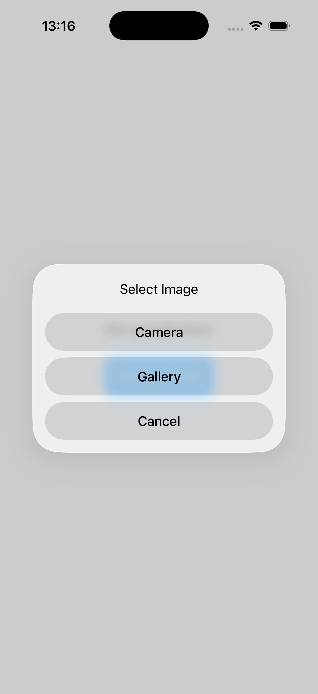
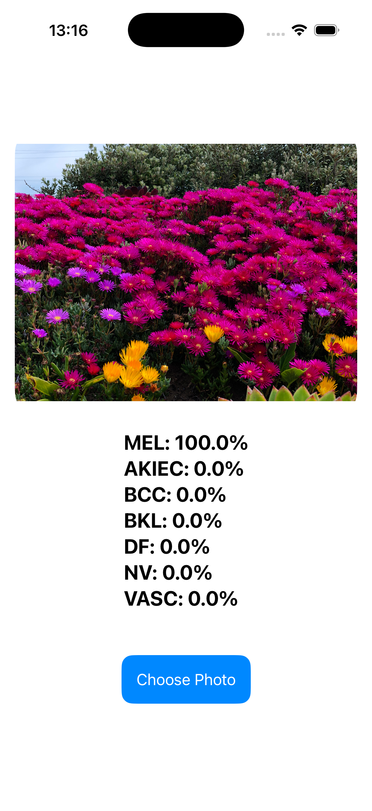

# Skin Cancer Detection - CoreML iOS Application

iOS application for classifying 7 types of skin lesions using CoreML and TensorFlow.

## Project Description

Mobile application for skin disease recognition from photos. The model is trained on the HAM10000 dataset and can identify 7 types of skin lesions with probability distribution for each class.

## Classified Types

| Code | Name | Type |
|------|------|------|
| akiec | Actinic keratoses | Precancerous condition |
| bcc | Basal cell carcinoma | Malignant tumor |
| bkl | Benign keratosis-like lesions | Benign lesion |
| df | Dermatofibroma | Benign tumor |
| nv | Melanocytic nevi | Benign nevus |
| vasc | Pyogenic granulomas | Benign vascular lesion |
| mel | Melanoma | Malignant melanoma |

## Technologies

- TensorFlow 2.15 - model training
- CoreML - conversion and iOS integration
- SwiftUI - application interface
- Python 3.9 - data preprocessing

## Model Architecture

- Input: 28x28 grayscale images
- Output: 7 classes with probability distribution
- Framework: TensorFlow/Keras

## iOS Application Features

- Photo selection from gallery
- Camera support
- Real-time classification
- Probability display for each class

## Installation

1. Clone the repository
2. Open .xcodeproj file in Xcode
3. Add the converted .mlmodel file to the project
4. Build and run on iOS device or simulator

## Model Conversion

```bash
python convert_to_coreml.py
```

## Screenshots

<table>
  <tr>
    <td></td>
    <td></td>
    <td></td>
  </tr>
  <tr>
    <td align="center">Main page</td>
    <td align="center">Source choice</td>
    <td align="center">Results</td>
  </tr>
</table>

